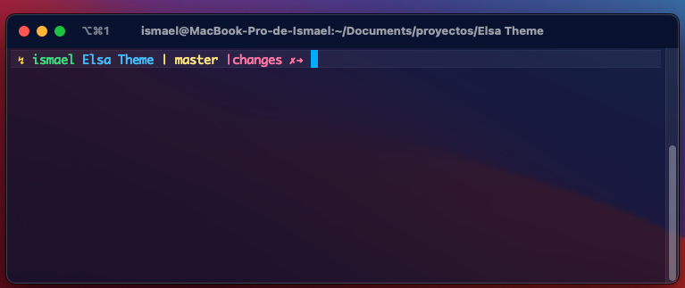
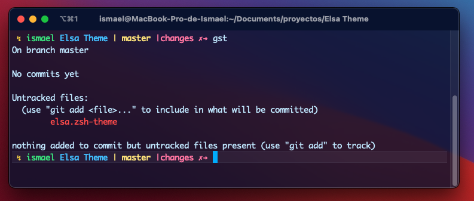
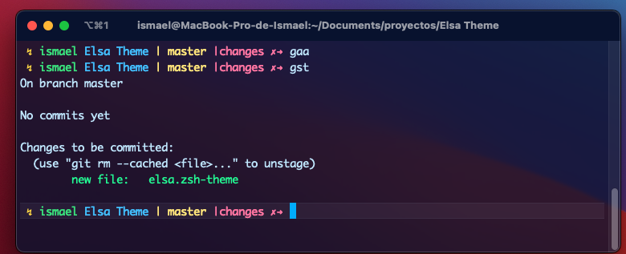
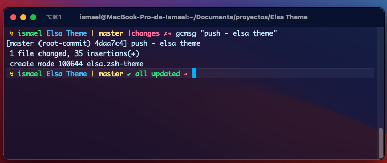
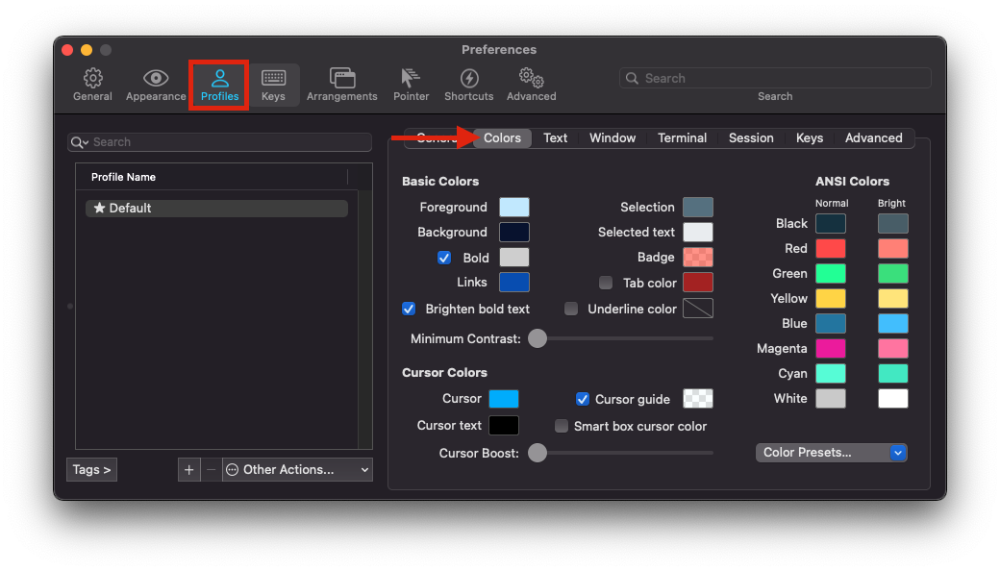
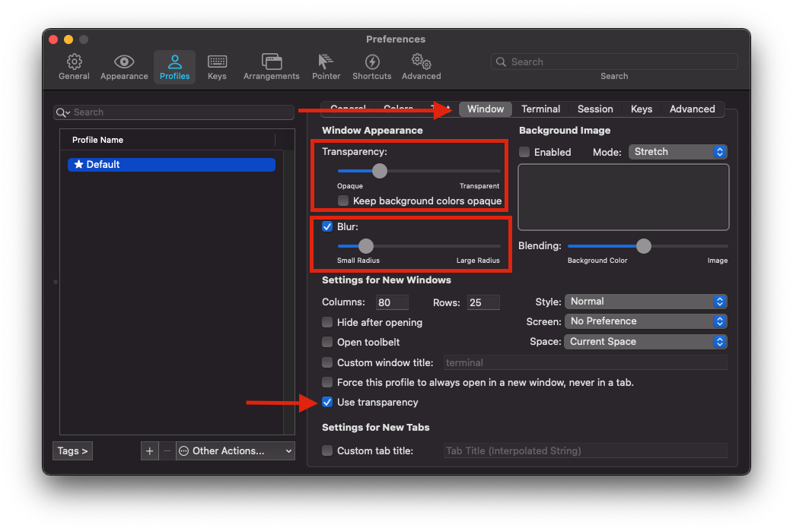

# elsa -- Oh My ZSH theme
Beautty Theme for ZSH - OH MY ZSH - ITEMR

## This Theme is inspired on my MOM.

### Syntax
The terminal with changes shows

username / foldername / branch name / indicator on magenta with changes label and x mark

display git status

staged file and display git status:

files commited and it displays all updated message to indicate all are commited

## Customizing the terminal (iTERM2)

if you want to customize the terminal like me, here's my configuration:
- Go to Iterm preferences and go to the panels that indicates below

### Color Palette
### Basic Colors

|    Color name     |        Value        |
|-------------------|---------------------|
|Foreground         |`#c8ebfe`            |
|Background         |`#061235`            |
|Bold(marked)       |`#d3d3d3`            |
|Links              |`#005bbb`            |
|Selection          |`#607c8b`            |
|Selected text      |`#eceef0`            |
|Badge              |`#ff2600` (RGBA)     |
|Tab Color          | No selected         |
|Underline Color    | No selected         |
|Underline Color    | No selected         |
|Brighten bold text | Selected            |

### ANSI Colors

|  Color name  |      NORMAL     |    BRIGHT    |
|--------------|-----------------|--------------|
|Black         |`#143848`        | `#516872`    |
|Red           |`#ff5151`        | `#ff8980`    |
|Green         |`#32ff9a`        | `#47e182`    |
|Yellow        |`#ffd73f`        | `#ffe47e`    |
|Blue          |`#2781a9`        | `#4bc7ff`    |
|Magenta       |`#ec25a8`        | `#ff80ab`    |
|Cyan          |`#64fcda`        | `#4feac7`    |
|White         |`#cfcfcf`        | `#fefefe`    |

### Cursor Colors
|        Color name       |               Value               |
|-------------------------|-----------------------------------|
|Cursor                   |`#00b8ff`                          |
|Cursor guide             |`#b3ecff` Selected - 16 on Alpha   |
|Cursor Text              |`#000000`                          |
|Smart box cursor color   | No selected                       |

Select the window tab, apply the transparency, check Blur option, and mark Use transparency option.